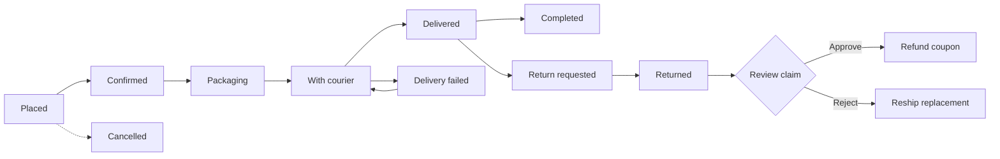

# Sovereign Watches

A luxury watch storefront with an admin portal built for store owners who are not developers.

**Live demo:** https://sovereign-e-commerce-store.vercel.app

Built with Next.js 15, React 19, TypeScript, Tailwind CSS and Supabase.


---

## The problem

Most small online stores run on WordPress (WooCommerce) or Shopify. They work, but store owners keep running into the same issues:

- **One plugin per function.** Order tracking, reviews, coupons, newsletters, invoices, SEO, backups and analytics each come from a separate plugin or app, often from different vendors.
- **Paid themes and recurring fees.** A theme licence, premium plugins and app subscriptions add up, and each has its own renewal.
- **Bloat.** Themes and plugins ship many features the shop never uses. That means extra code, extra settings screens and heavier pages.
- **An admin built for developers.** A non-technical owner who only wants to add a product, confirm an order and enter a tracking number has to find it among hundreds of settings spread across plugins.
- **Maintenance risk.** Every plugin is another thing to update, and updates can conflict with each other or with the theme.

## The solution

Sovereign starts from the other end: **what does a store admin actually do every day?** It builds exactly those tools, in one admin panel, and nothing else.

| Store owner's task | Typical WordPress / Shopify setup | Sovereign |
|---|---|---|
| Add products | Core store, plus extra plugins for galleries, specs, bulk import | One product form: gallery, specs, stock, sale price, CSV import |
| Process an order | Core, plus a plugin for courier tracking and status emails | Guided order workflow with courier and tracking built in |
| Handle returns and refunds | Extension or manual process | Return claim review and refund coupon in the order page |
| Run discounts | Core or coupon plugin | Coupons page |
| Moderate reviews | Reviews plugin | Reviews page |
| Answer enquiries | Contact-form plugin plus inbox | Messages page with one-click replies |
| Email customers | Newsletter plugin or external service | Subscribers and campaigns page |
| Set shipping and payment options | Several settings screens and plugins | One "Delivery & Payments" page |

The result is one 11-page admin panel, not a plugin marketplace. A new owner can learn it in an afternoon, and there is no per-function plugin to buy, update or conflict.

### Trade-offs

This is a custom codebase, not a platform with an app ecosystem. You get a lean, purpose-built store, but you also own its maintenance, and there is no plugin for every edge case. 

---

## Admin portal features

The admin lives at `/admin`. Only users with the `admin` role can use it, and every admin API route re-checks that role on the server.

### Dashboard
- Today's sales, total sales, average order value
- Customers, with how many are new this week
- Order counts: pending, in transit, completed, refunded and cancelled
- 14-day revenue trend chart
- Top best-selling products
- Recent orders at a glance

### Products
- Create, edit, delete and search products by name or SKU
- Price and optional sale price, stock quantity, and a per-product low-stock threshold
- SKU generated automatically if left blank
- Hero image and a gallery of up to 5 images or videos, uploaded or linked, with alt text for SEO and accessibility
- Watch specifications (movement, case material, strap material, case size, dial colour, water resistance, gender, warranty) plus custom key/value specs
- Draft or active status, and collection flags: featured, new arrival, latest edition, best seller
- **CSV import** for adding many products at once

### Categories
- Create, edit and delete categories with name, slug, description, image and sort order

### Orders
- Search by order number, customer name, email or phone, and filter by status
- Guided fulfilment flow with server-side validation, so orders can only move to valid next steps:



- Courier name and tracking number entry (an order cannot be marked delivered without them)
- Status history with notes for every change
- Stock is automatically restored when an order is cancelled, returned or refunded
- Return handling: receive, approve or reject a claim (a rejection needs a written reason), then issue a refund coupon
- Replacement shipping details for rejected claims
- Payment status updates
- Printable invoice for confirmed orders
- Customers are emailed on status updates

### Customers
- Registered customers with order count, total spent and last order date, sorted by lifetime value

### Coupons
- Percent or fixed-amount codes with minimum order, usage limit and usage count
- Separate listing for refund coupons created from returns

### Reviews
- Approve, reject or delete customer reviews; pending reviews are counted in the dashboard stats

### Messages
- Contact-form enquiries with status (pending, acknowledged, resolved)
- One-click Acknowledge and Resolved responses with preset replies

### Newsletter
- Subscriber list with subscribe / unsubscribe toggle
- Send a campaign (HTML content) to all active subscribers, with a log of delivered and failed counts

### Team & Invites
- See current administrators, record invites by email, cancel invites, and remove admin access (you cannot remove your own)

### Delivery & Payments
- Free-shipping threshold
- Standard and express delivery charge and delivery time
- Switch payment channels on or off: Cash on Delivery, Bank Transfer (IBFT), PayFast

---

## Storefront features

- Home, shop and product pages
- Cart and checkout for guests and signed-in customers
- Guest order tracking (`/track`)
- Customer accounts: profile with avatar, order history, saved addresses, wishlist
- Product reviews and a contact form
- Newsletter sign-up
- Email/password sign-up and login, email verification, password reset

Built for the Pakistani market: prices in PKR, Cash on Delivery, bank transfer, and PayFast.

---

## Tech stack

| Area | Technology |
|---|---|
| Framework | Next.js 15 (App Router) |
| UI | React 19, TypeScript |
| Styling | Tailwind CSS v4, Radix UI, shadcn-style components, Lucide icons, Framer Motion |
| Charts | Recharts |
| Backend | Supabase Auth and PostgreSQL |
| File storage | Supabase Storage (`product-media` bucket, profile images) |
| Payments | PayFast |
| Email | Gmail SMTP |
| Hosting | Vercel |

## Project structure

```
app/                  Routes, layouts and API handlers (App Router)
  admin/              Admin portal pages
  api/admin/          Admin-only API routes (role-checked)
  api/                Storefront, orders, payments and auth routes
components/           UI and feature components
hooks/                Reusable React hooks
lib/                  Supabase clients, DB helpers, email, store constants
types/                Shared TypeScript types
supabase/migrations/  Database schema (Schema.sql)
public/               Static assets
proxy.ts              Session refresh for Supabase auth
```

## Main routes

| Route | Purpose |
|---|---|
| `/` | Storefront home |
| `/shop` | Product catalog |
| `/product/[slug]` | Product details |
| `/cart` | Shopping cart |
| `/checkout` | Guest and authenticated checkout |
| `/auth` | Registration and login |
| `/account` | Profile, orders, addresses, wishlist |
| `/track` | Guest order tracking |
| `/admin` | Admin dashboard (role-protected) |

---

## Getting started

### Prerequisites
- Node.js 18.18 or later
- A [Supabase](https://supabase.com) project

### 1. Install and run

```bash
git clone https://github.com/bc220406446/sovereign-e-commerce-store.git
cd sovereign-e-commerce-store
npm install
npm run dev
```

Open http://localhost:3000.

### 2. Environment variables

Create `.env.local` in the project root:

```bash
# Supabase
NEXT_PUBLIC_SUPABASE_URL=your_supabase_project_url
NEXT_PUBLIC_SUPABASE_ANON_KEY=your_supabase_publishable_key
SUPABASE_SERVICE_ROLE_KEY=your_supabase_secret_key
NEXT_PUBLIC_SITE_URL=http://localhost:3000

# Email (Gmail SMTP)
GMAIL_USER=your_gmail_address
GMAIL_APP_PASSWORD=your_gmail_app_password
EMAIL_FROM="Sovereign Watches <your_gmail_address>"

# PayFast
PAYFAST_MERCHANT_ID=your_merchant_id
PAYFAST_MERCHANT_KEY=your_merchant_key
PAYFAST_PASSPHRASE=your_passphrase
PAYFAST_SANDBOX=true
```

Keep every secret key server-side and never commit `.env.local`.

### 3. Set up the database

In the Supabase SQL Editor, run the whole of `supabase/migrations/Schema.sql`. It creates the tables for profiles, categories, products, settings, addresses, orders, wishlist, admin invites, coupons, reviews, contact messages and newsletter subscribers and campaigns.

Passwords are managed by Supabase Auth and are never stored in `public.profiles`.

### 4. Create the storage bucket

In Supabase Storage, create a public bucket named `product-media` for product images and videos.

### 5. Configure auth redirects

In Supabase, under Authentication → URL Configuration, add:

```
http://localhost:3000
http://localhost:3000/api/auth/callback
```

Add the matching production URLs when you deploy.

### 6. Create your first admin

Register a normal account on `/auth`, then promote it in the SQL Editor:

```sql
update public.profiles
set role = 'admin'
where email = 'admin@example.com';
```

Sign in again and you will be redirected to `/admin`. There is no public admin registration.

### 7. Add sample products (development only)

```bash
curl -X POST http://localhost:3000/api/seed
```

On Windows PowerShell:

```powershell
Invoke-RestMethod -Method Post http://localhost:3000/api/seed
```

---

## Deployment

```bash
npm run build
npm run start
```

On Vercel (or another host):

1. Import the repository and add the environment variables, using your production `NEXT_PUBLIC_SITE_URL` and `PAYFAST_SANDBOX=false` for live payments.
2. Add the production URL and `/api/auth/callback` to Supabase Authentication URL Configuration.
3. Point the PayFast notify URL at `/api/payments/payfast/itn`.

### Before going live

- [ ] Remove or protect `/api/seed`
- [ ] Enable Row Level Security on every Supabase table and review the policies (server routes use the service role key, which bypasses RLS)
- [ ] Never expose `SUPABASE_SERVICE_ROLE_KEY` to the browser
- [ ] Switch PayFast out of sandbox mode
- [ ] Send a test order through checkout, fulfilment and a return


